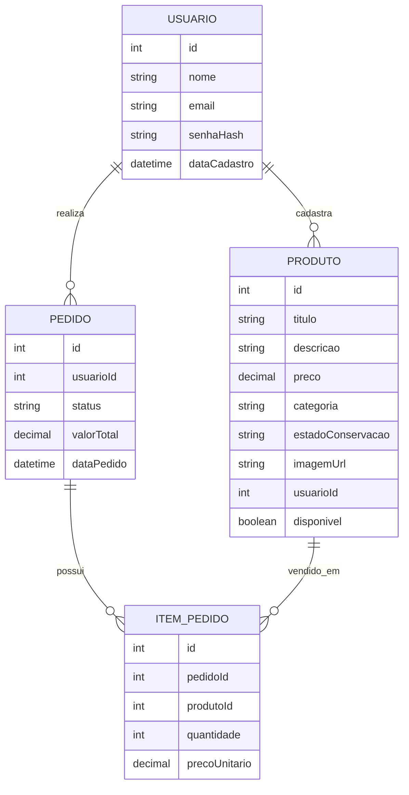
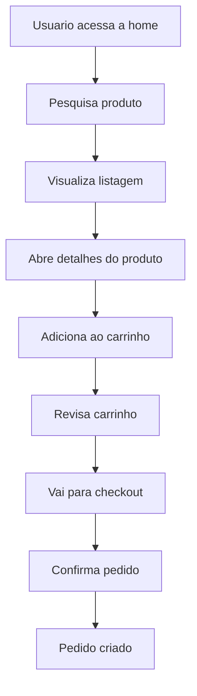

# Diagramas — ReUseTech

## Diagrama ER Conceitual

```mermaid
erDiagram
    USUARIO ||--o{ PRODUTO : cadastra
    USUARIO ||--o{ PEDIDO : realiza
    PEDIDO ||--o{ ITEM_PEDIDO : possui
    PRODUTO ||--o{ ITEM_PEDIDO : vendido_em

    USUARIO {
        int id
        string nome
        string email
        string senhaHash
        datetime dataCadastro
    }

    PRODUTO {
        int id
        string titulo
        string descricao
        decimal preco
        string categoria
        string estadoConservacao
        string imagemUrl
        int usuarioId
        boolean disponivel
    }

    PEDIDO {
        int id
        int usuarioId
        string status
        decimal valorTotal
        datetime dataPedido
    }

    ITEM_PEDIDO {
        int id
        int pedidoId
        int produtoId
        int quantidade
        decimal precoUnitario
    }
```

## Diagrama de Fluxo do Usuario

```mermaid
flowchart TD
    A[Usuario acessa a home] --> B[Pesquisa produto]
    B --> C[Visualiza listagem]
    C --> D[Abre detalhes do produto]
    D --> E[Adiciona ao carrinho]
    E --> F[Revisa carrinho]
    F --> G[Vai para checkout]
    G --> H[Confirma pedido]
    H --> I[Pedido criado]
```
